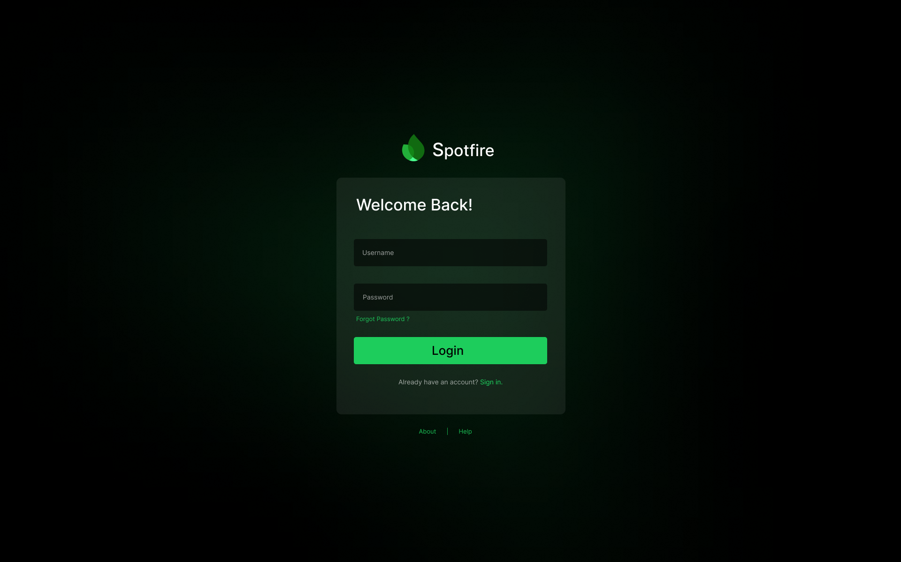
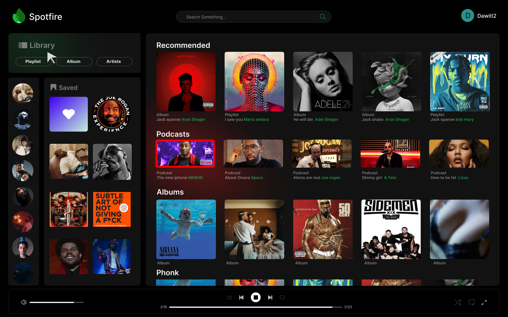

# **Spotfire**  
*Your Personal Music Streaming Platform*

---

## **About the Project**

**Spotfire** is a front-end music streaming web app created as a personal project to explore and showcase web design and development. It delivers a clean and familiar UI, heavily inspired by Spotify, allowing users to sign in and stream music from a single account.

---

## **Key Features**  

- **Clean & Responsive UI**  
  Designed to closely resemble Spotify’s interface for a modern and seamless experience.

- **Single Account Access**  
  Users can sign in to their account and start listening right away.

- **Music Player**  
  Built-in player to play/pause, skip tracks, and control volume (mock functionality).

- **Playlist Feel**  
  UI mimics playlist browsing and track lists for a familiar streaming experience.

---

## **Tech Stack**

- **HTML**
- **CSS**
- **JavaScript**

---

## **Project Purpose**

Spotfire was built as a personal side project with the goal of sharpening front-end development skills. Unlike other school-related assignments, this project was created independently to replicate and understand real-world UI/UX patterns.

---

## **Live Demo / Getting Started**

Coming soon... 

---

